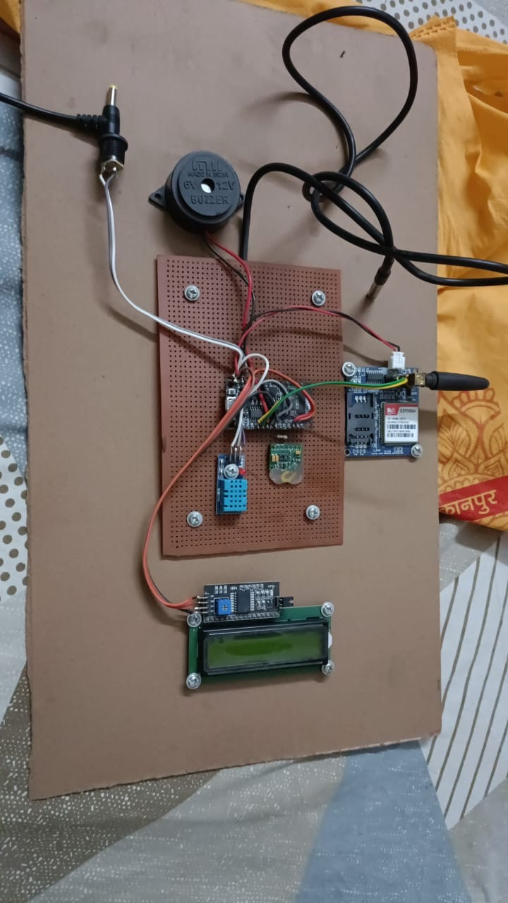
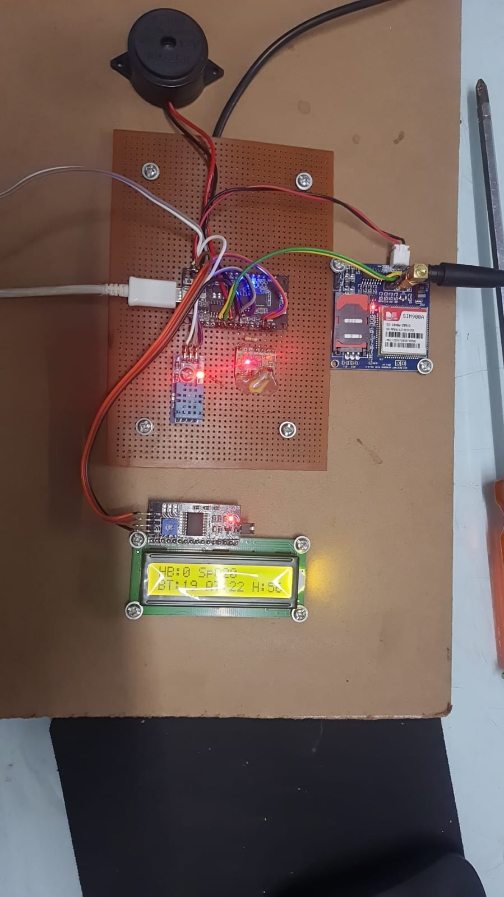
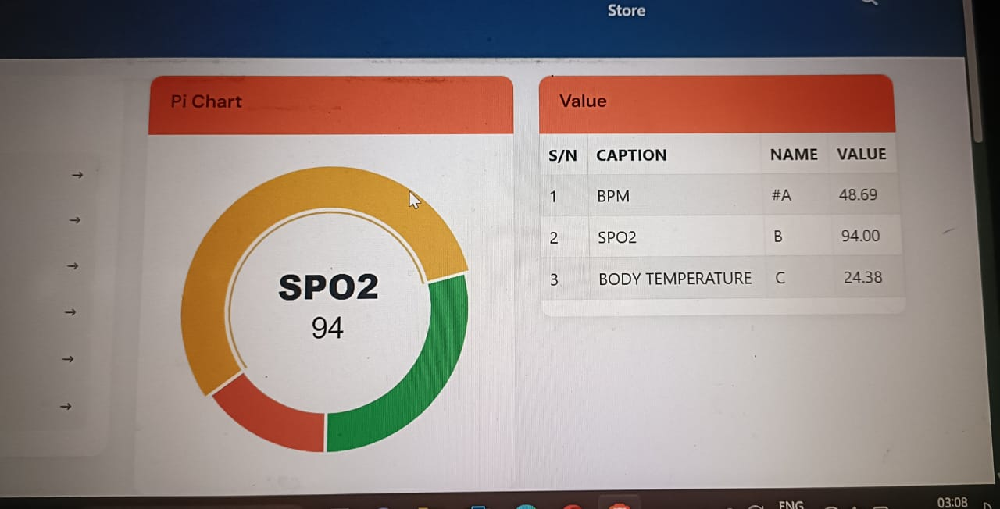
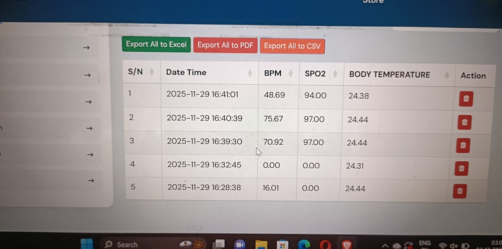
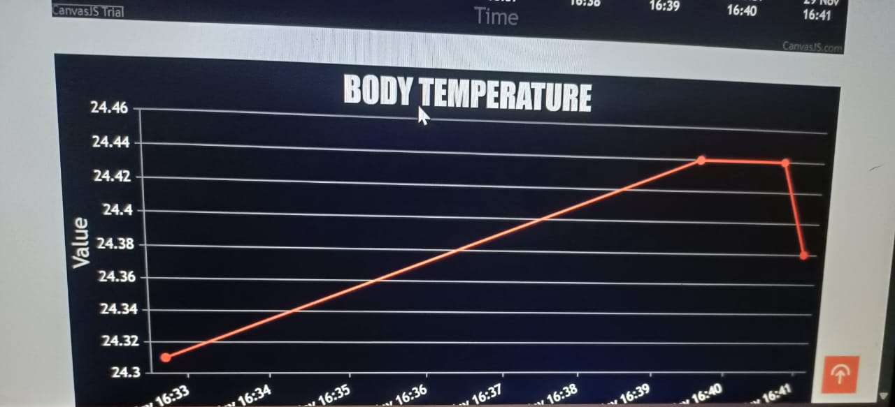
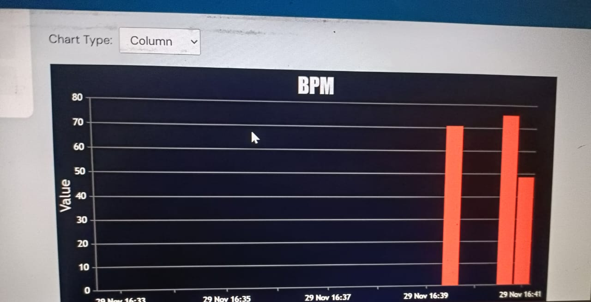

<div align="center">

# 🏥 IoT-Based Patient Health Monitoring System
### Real-Time Vital Sign Monitoring + Machine Learning Anomaly Detection

[](https://python.org)
[](https://streamlit.io)
[](https://flask.palletsprojects.com)
[](https://scikit-learn.org)
[](https://arduino.cc)

*Final Year Project — Registration: 25PSITCS011*

</div>

---

## 📷 Hardware

<p align="center">
  
  &nbsp;
  
</p>

> **Left:** Complete assembled board with all components. **Right:** Device powered ON — LCD showing live readings (HB, SpO₂, Body Temp, Humidity), SIM900A GSM module active with antenna, sensor LEDs lit.

---

## 📌 Project Overview

A complete end-to-end IoT health monitoring system that:

- 🔴 Collects patient vitals continuously via hardware sensors
- 📡 Transmits data wirelessly via SIM900A GSM (SMS every 30 seconds)
- 🌐 Stores data on a Cloud IoT Panel with live charts
- 🤖 Detects anomalies using **Isolation Forest** ML model
- 📊 Displays live readings on a **Streamlit dashboard** with alerts
- 🔔 Triggers **buzzer + LCD** instantly on abnormal readings

---

## 🌐 Cloud IoT Dashboard

### 📊 Live Data Table
<p align="center">
  
</p>

> Timestamped readings of BPM, SPO2, and Body Temperature — with Export to Excel / PDF / CSV.

---

### 🩸 SPO₂ Live Gauge
<p align="center">
  
</p>

> Live donut gauge: SPO2 = **94%**, BPM = 48.69, Body Temp = 24.38°C.

---

### 💓 BPM Live Chart
<p align="center">
  
</p>

> Real-time BPM column chart — spikes clearly visible reaching 70+ bpm on active readings.

---

### 🌡️ Body Temperature Chart
<p align="center">
  
</p>

> Live line chart showing body temperature trend — rising from 24.31°C to 24.43°C captured from sensor.

---

## 🏗️ System Architecture

```
┌─────────────────────────────────────────────┐
│              HARDWARE LAYER                 │
│  MAX30100 → BPM + SpO₂                      │
│  DHT11    → Body Temp + Ambient + Humidity  │
│  NodeMCU ESP32 (reads + transmits)          │
│       │                  │                  │
│  USB Serial         SIM900A GSM             │
└───────┼──────────────────┼──────────────────┘
        │                  │
        ▼                  ▼
  reader.py          Cloud IoT Panel
  server.py          (Live Charts + Export CSV)
  iot_data.csv
        │
        ▼
  ML Pipeline
  (Clean → Scale → Isolation Forest)
  anomaly_model.pkl + scaler.pkl
        │
        ▼
  Streamlit Dashboard (app.py)
  Normal ✅  /  Abnormal 🚨
```

---

## 📦 Hardware Components

| Component | Role |
|---|---|
| NodeMCU ESP32 | Main microcontroller |
| MAX30100 | Heart Rate + SpO₂ |
| DHT11 | Temperature + Humidity |
| SIM900A GSM | Wireless SMS + Cloud data |
| 16×2 LCD (I2C) | On-device live display |
| 6V–12V Buzzer | Local alarm on abnormal reading |
| Perf Board + DC Supply | Assembly + power |

---

## 📊 Sensor Parameters

| Field | Parameter | Unit | Healthy Range |
|---|---|---|---|
| 884 | Heart Rate (BPM) | beats/min | 60–100 |
| 885 | SpO₂ | % | 95–100 |
| 886 | Body Temperature | °C | 36.1–37.2 |
| 887 | Ambient Temperature | °C | — |
| 888 | Humidity | % | — |

---

## 🤖 Machine Learning

| Property | Value |
|---|---|
| Algorithm | Isolation Forest (Unsupervised) |
| Library | scikit-learn |
| Contamination | 10% |
| Train / Test | 93 / 24 samples |
| Dataset | 118 real readings (May 2026) |
| Result | ✅ 22 Normal, 🚨 2 Abnormal |

### Pipeline
```
Raw CSV → Parse JSON → Clean zeros (median fill)
→ IQR clipping → StandardScaler
→ Isolation Forest → Normal / Abnormal
→ Save: anomaly_model.pkl + scaler.pkl
```

---

## 🗂️ Project Structure

```
IoT-Based-patient-Monitoring-System/
├── app.py                    ← Streamlit dashboard
├── server.py                 ← Flask API
├── reader.py                 ← Arduino serial reader
├── send_test_data.py         ← Test without hardware
├── iot_project.ipynb         ← ML training notebook
├── anomaly_model.pkl         ← Trained model
├── scaler.pkl                ← Fitted scaler
├── iot_data.csv              ← 118 sensor readings
├── hardware_off.JPG          ← Hardware photo
├── hardware_on.jpg           ← Hardware running
├── dashboard_table.jpeg      ← Data table screenshot
├── dashboard_spo2.jpeg       ← SPO2 gauge screenshot
├── dashboard_bpm.jpeg        ← BPM chart screenshot
├── dashboard_temp.jpeg       ← Temperature chart
└── README.md
```

---

## 🚀 How to Run

```bash
# Install dependencies
pip install streamlit flask pandas numpy scikit-learn matplotlib seaborn joblib pyserial requests

# With hardware — start server
python server.py

# Without hardware — send test data
python send_test_data.py

# Launch dashboard
streamlit run app.py
```

---

## 🔮 Future Scope

- Mobile app for remote alerts
- ECG sensor integration
- Auto SMS via Twilio on anomaly
- Multi-patient dashboard
- LSTM for time-series prediction
- AWS IoT / Google Cloud deployment

---

<div align="center">

**⭐ Star this repo if you found it helpful!**

*Built with ❤️ using IoT + Python + Machine Learning*

</div>
